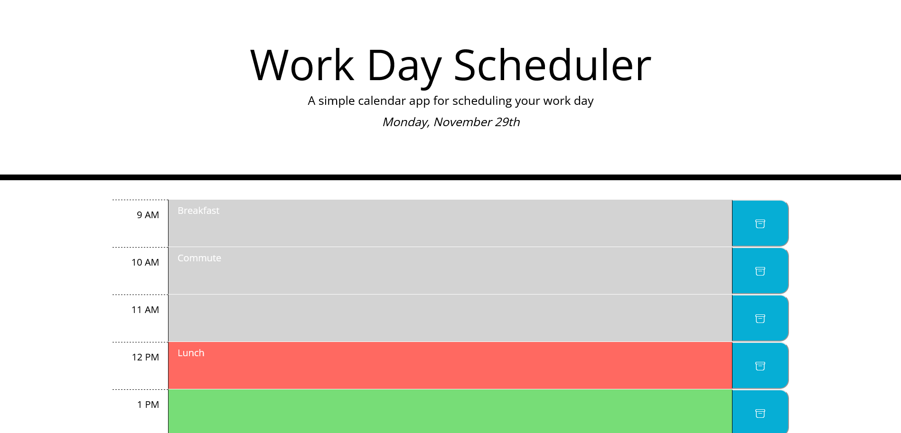

# Work Day Scheduler

## Description
An online work-day schedule planner. Includes a text input for each hour of the work day where the user may input what they're doing during that time. The current, prior, and upcoming hours are highlighted in red, grey, and green respectively. The user may also save their input in localStorage using the blue button on the left of the time blocks.

## Links
[Deployed Page](https://staticcloud.github.io/super-disco/)

## Overview

Here's an overview of the application!

